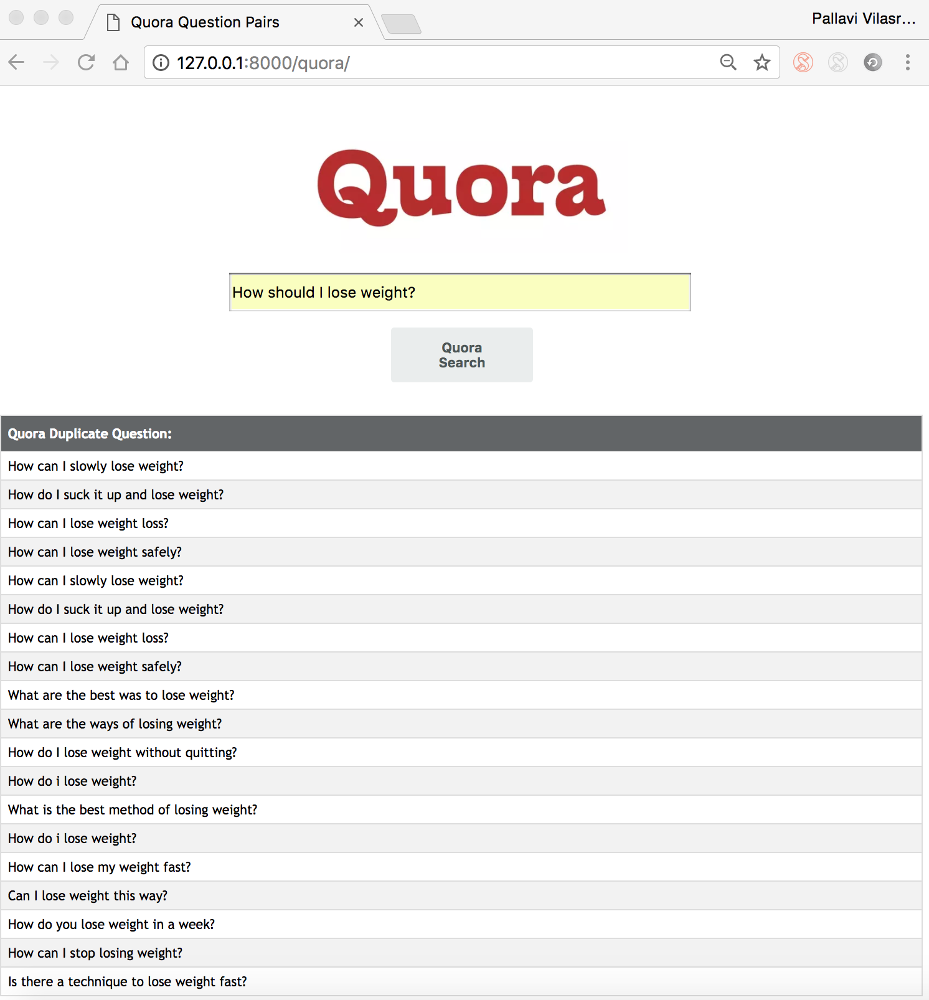

# QuoraQuestionPairs
In this project, we are detecting the similarity between question by training the XGboost model on the quora's dataset.

## Description :

###  Dataset: https://www.kaggle.com/c/quora-question-pairs/data
  The dataset used for this analysis was provided by  Quora , released as their first public dataset as described above. 
  It consists of  404352  question pairs in a tab-separated format:
•    id :   unique identifier for  the question pair
•    qid1 :   unique  identifier for the  first  question
•    qid2 :   unique  identifier for the  second  question
•    question1 : full  unicode  text  of  the first  question
•    question2 : full  unicode  text  of the  second question
•    is_duplicate : label 1 if questions are duplicates,  0  otherwise

### Classes :
   -  **Cleaning.py**
      In this class, we preprocess the quora's question pair set by checking for spelling check,removing for stopwords and stemming. 
     
   -  **Features.py**
      In this class , we extract features for training xgboost model.
      Feature set :
      word match between two sentences
      tdIDF for two sentences 
      
   -  **ConnectionFront.py**
      In this class , the request from user is given to the model for prediction . After receiving the prediction, we render 
      to the user the results of prediction.
      
 ### Output :
  - **Similar Question** 
    
   
